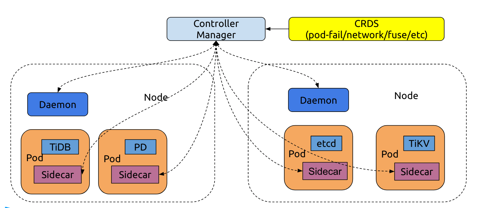

# Chaos Operator
Chaos Operator is a powerful chaos engineering tool for kubernetes. 
It is used to inject chaos into the applications and Kubernetes infrastructure in a managed fashion. 

Chaos Operator is a Kubernetes Operator, which provides easy definitions for chaos experiments and 
automates the execution of chaos experiments.



## Deploy 

### Prerequisites 

Before deploying Chaos Operator, make sure the following items are installed on your machine: 

* Kubernetes >= v1.12
* [RBAC](https://kubernetes.io/docs/admin/authorization/rbac) enabled (optional)
* Helm version >= v2.8.2 and < v3.0.0
* Protobuf version >= v3.6.1 and < v3.7.0 and go support

### Install Chaos Operator

#### Get the Helm files

```bash
$ git clone https://github.com/pingcap/chaos-operator.git
$ cd chaos-operator/
```

#### Create custom resource type

Chaos Operator uses [CRD (Custom Resource Definition)](https://kubernetes.io/docs/tasks/access-kubernetes-api/custom-resources/custom-resource-definitions/) 
to extend Kubernetes. Therefore, to use Chaos Operator, you must first create the related custom resource type.

```bash
$ kubectl apply -f manifests/
$ kubectl get crd podchaos.pingcap.com
```

#### Install Chaos Operator

```bash
$ helm install helm/chaos-operator --name=chaos-operator --namespace=chaos-testing
$ kubectl get pods --namespace chaos-testing -l app.kubernetes.io/instance=chaos-operator
```

## Usage

#### Define chaos experiment config file 

eg: define a chaos experiment to kill one tikv pod randomly

create a chaos experiment file and name it pod-kill-example.yaml

```yaml
apiVersion: pingcap.com/v1alpha1
kind: PodChaos
metadata:
  name: pod-kill-example
  namespace: chaos-testing
spec:
  action: pod-kill
  mode: one
  selector:
    namespaces:
      - tidb-cluster-demo
    labelSelectors:
      "app.kubernetes.io/component": "tikv"
  scheduler:
    cron: "@every 1m"
```

##### PodChaos

PodChaos designs for the chaos experiments about pods.

* **action** defines the specific pod chaos action, supported action: pod-kill / pod-failure
* **mode** defines the mode to run chaos action, supported mode: one / all / fixed / fixed-percent / random-max-percent
* **selector** is used to select pods that are used to inject chaos action.
* **scheduler** defines some scheduler rules to the running time of the chaos experiment about pods. 
More cron rule info: https://godoc.org/github.com/robfig/cron


more examples: [https://github.com/pingcap/chaos-operator/tree/master/examples](https://github.com/pingcap/chaos-operator/tree/master/examples) 

#### Create a chaos experiment

```bash
$ kubectl apply -f pod-kill-example.yaml
$ kubectl get podchaos --namespace=chaos-testing
```

#### Update a chaos experiment

```bash
$ vim pod-kill-example.yaml
$ kubectl apply -f pod-kill-example.yaml
```

#### Delete a chaos experiment

```bash
$ kubectl delete -f pod-kill-example.yaml
```
